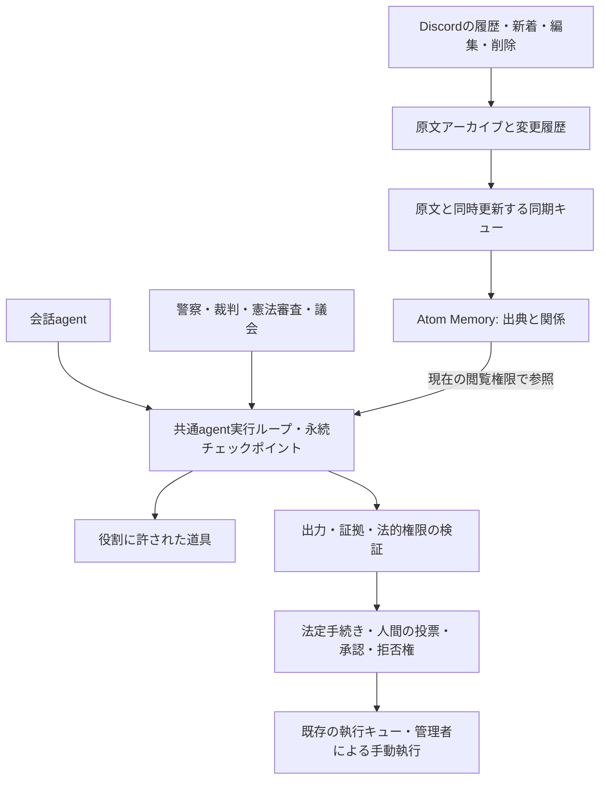

# 会話構造・Atom Memory・agent実行基盤

Sakanaの会話agent、警察、裁判所、憲法審査院、議会は `src/ai/runtime.js` の同じ実行ループを使う。役割ごとに変えるのは、モデル接続、入力、許可された道具、予算、結果の検証である。統治の機関・手続き・調査権限は、引き続き適用される憲法と成立した組織法が定義する。



## 会話を文字列の列として扱わない

`src/conversation/message.js` が `discord.message.v1` を定義する。新着、検索結果、アーカイブ、統治の調査、Atomへの保存に共通の構造を使う。

|項目|意味|
|---|---|
|`id` / `location`|発言ID、サーバー、チャンネル、スレッドと親チャンネル|
|`author`|発言者ID・表示名・botか・応答中のbot自身か|
|`body`|投稿者が書いた本文。抜粋なら `complete=false` と元の長さを明示|
|`reference`|返信、転送、スレッド起点、旧記録で種類不明の参照を区別。宛先IDと取得状態を保持|
|`forwarded`|転送スナップショット。Discordが原著者を返さなければ `authorId=null`|
|`attachments` / `embeds` / `stickers`|本文と分離した添付。埋め込みの説明を送信者の主張にしない|
|`mentions` / `reactions`|言及・リアクション。返信や賛否の確定とは扱わない|
|`state`|作成時刻・編集時刻・削除・ピン・メッセージ種別・観測したメタデータ|

返信先の参照番号は結果の表示順に左右されない。参照先を取得できなければIDを残し、未取得・取得不能・確認された削除を区別する。転送は返信連鎖に含めない。会話の先読みでは別チャンネルへ参照をたどらず、閲覧権限を持つ読み取り手段に任せる。返信連鎖の深さ上限も明示する。

既存DBの本文から「これは返信だった」「原著者はこの人」と推定しない。古い行は `legacy_incomplete` とし、Discordから再取得できた時点で埋める。引用文や二人称の意味までは機械的に確定できないため、agentは明示された関係と文脈を見て判断する。

## 記憶の所有者と出典

情報の分離単位はDiscordのサーバーIDにする。同じbotとSQLiteを共有しても、履歴のID指定・返信の辿り直し・リアクション・模倣用の実発言・Atomの記憶と集計値・agentの途中記録は、呼び出し元サーバーの範囲で扱う。非公開チャンネルの閲覧条件も維持する。同じrun IDでも別サーバーの実行は再開しない。モデル自体の利用先にはサーバー制約を設けない。

モデル選択と話者設定は `(guild_id, user_id)` ごとに保存する。旧来のユーザー単位の設定は所属先を断定できないため、`agent_engine_legacy_unscoped` / `agent_persona_legacy_unscoped` に保持し、各サーバーへ自動配布しない。新しいサーバー別設定の既定は通常のagentとbot自身の話者である。

- ライブラリは独立した `subprojects/atom-memory` の公開エントリーポイントを使う。独自のAtom実装やライブラリ内へのSakana固有処理は追加しない。
- 原文の正本はアーカイブ。Atomは読み取り用の派生保存先で、メッセージから発言者・チャンネル・スレッドへの関係を持つ。返信先IDはメッセージ内に明示する。
- 権限はサーバー・チャンネルごとのpolicyにする。entityも同じ範囲に置き、関係をたどることで別の非公開チャンネルへ越境させない。
- 会話の自動想起は応答するチャンネルに限定する。統治の自動想起は現在公開されているチャンネルに限定し、機関に `search_messages` が許可されている場合だけ使う。取得した新しい原文は法定の調査手数・出力量へ計上する。
- 原文の取り込み権限はhostだけが持つ。AIの生成物を原文・証拠・法律へ昇格させない。今回の構造化は原文とDiscordの関係の整理であり、全発言から主張や人物像をLLMで抽出する処理ではない。
- 編集・削除は永続キューで追随する。旧Atomをpurgeし、それに依存する観測を無効にする。原文を読んでから回答するまでに変更や権限失効があれば、その実行を失効させる。統治の再試行では新しい記録から調査し直す。
- アーカイブの `message_versions` は導入後に観測した本文の編集・削除前の状態を保存する。導入前の編集履歴や、既に消えて取得できない発言を復元したことにはしない。

Atomの自動想起は予算内の候補検索で、全履歴の完全走査ではない。診断と同期残数を入力へ添える。候補に出なかったことを「発言が存在しない」と解釈せず、必要なら既存のアーカイブ検索で全期間を調べる。

大量取り込みではAtomのSQLiteを `synchronous: 'NORMAL'` で使い、バッチの `flush()` が成功してから原文側のキューを確認・削除する。保存途中の停止やflush失敗では処理済みにしない。Atomの通常利用は従来どおり `FULL` が既定である。Bot稼働中にDiscordを再取得するCLIは `--index-only` を付け、Atomへの書き込みをBotのworkerに任せる。

## 共通実行ループ

モデルが道具を選び、hostが許可と予算を検査して実行し、観測を保存して次の推論へ進む。最終結果は従来のスキーマ・引用・法的条件の検証を通す。

- それぞれの道具の結果とカーソルを、次のAPI呼び出しより前にSQLiteへ保存する。調査の通信失敗は実行失敗として再試行し、有罪・無罪・不受理には変換しない。
- 同じ入力の未完了runは再開する。完了したrunと独立の再審議は別runにし、過去の判決を単なる入力一致で再利用しない。
- 再開時に参照先や権限が失効していれば、古い観測を使うrunを破棄して次回は新規調査にする。
- 法律・憲法・会話の長いツール結果は、JSONを壊さず `documentHash` / `offset` / `nextOffset` 付きでページ化する。未読部分を証拠台帳へ登録しない。同じ結果を読み直した場合は、入力内に残した最初の全文を参照する。
- 憲法の調査ツールには当該事件・手続きに固定された憲法を渡す。調査中に改憲されても、その事件の準拠版が勝手に変わらない。
- 証拠採用時にはDiscordの原文・発言者・ハッシュ・閲覧権限を再確認し、返信・転送等の会話構造も事件記録へ固定する。追加調査で見つけた資料にも同じ確認を適用し、再取得の通信障害を「資料なし」として判決へ進めない。
- 警察・裁判・憲法審査のagentは調査と構造化判断を担当する。投票、承認、拒否権、判決の執行は既存の法定手続きと権限検査を通る。ban/kick等の管理者による手動執行はそのまま維持する。
- ブラウザなど外部状態を変え得る道具が実行中に途切れた場合、結果が不明な操作を自動で再送しない。読み取り専用の調査とは再開条件が異なる。

内部推論の `reasoning_content` はチェックポイントへ保存しない。保存するのは入力、通常のモデル応答、実行した道具、観測、予算、検証済みの結果である。実行DBはhost側の監査データであり、一般会話への無条件の記憶入力にはしない。

## セットアップと既存履歴の移行

### 既存設備で動かす構成

常駐するNode botと同じホストにアーカイブ、Atom DB、実行DBを置く。構造化のために別サーバー、外部ベクトルDB、GPUを追加する必要はない。返信・転送・編集等の構造はDiscordのデータから決定的に作り、各発言をLLMへ送って分類する費用を発生させない。会話や調査のモデル呼び出しは、各役割の予算内で従来の推論先を使う。

既存アーカイブを移行元にし、メタデータが不足する記録だけを取得可能な範囲で補う。Atomへの同期は専用worker threadで少量ずつチェックポイントを残し、Discordの応答処理を止めない。検索時に全件同期を待たず、同期待ちの原文を候補から除外する。保存先は派生データと変更履歴の分だけ増えるため、本番の全件移行前に小規模なコピーで追加容量と処理速度を測定する。常駐中の別モデルの整理は、この移行とは別の運用判断にする。

Node.js 22.13以上が必要。

```sh
git submodule update --init subprojects/atom-memory
npm ci
npm run check
```

`npm ci` のprepareで固定したAtomソースをビルドする。コンパイラは `atom-memory-typescript` というnpm aliasに固定し、既存UI依存のTypeScript peerと混在させない。production用にdevDependenciesを取り除く場合はビルド後に行い、Atomのdistを実行環境に含める。

既にアーカイブにある履歴を構造化する:

```sh
npm run memory:structure
```

対象サーバーを明示してDiscordから取得できる最古まで取り込み、Atomへ同期する:

```sh
npm run memory:structure -- --discord --guild SERVER_ID
```

従来の取り込みで返信・転送等のメタデータが不足している場合は、原文を保持したままDiscordの取得位置をリセットして再取得する:

```sh
npm run memory:structure -- --discord --guild SERVER_ID --refresh-structure
```

このCLIはbotの応答・メッセージ送信・退出・統治スケジューラを開始しない。取り込みは既存indexerのチェックポイントで再開する。`--refresh-structure` を再度指定すると先頭から再取得するので、中断からの再開時は外す。

通常起動時は既存の履歴取り込み設定に従ってアーカイブを更新し、5秒ごとのworkerがAtomへ同期する。履歴の取得範囲は既存indexerの被覆状況で確認する。権限不足、既に削除された発言、列挙上限に達したスレッドなどは欠損として扱い、キューが空になっただけで「Discordの全履歴を保有した」とは判定しない。

|設定|既定値|
|---|---|
|`ARCHIVE_DB_PATH`|`archive.sqlite`|
|`ATOM_MEMORY_PATH`|`ARCHIVE_DB_PATH` + `.atoms.sqlite`|
|`AGENT_RUNTIME_PATH`|`DATABASE_PATH` + `.agents.sqlite`|

アーカイブ、Atom DB、実行DBはそれぞれWALを含めてバックアップ対象とする。Atom DBを新規作成した場合はアーカイブ全件を再同期する。

## 検証

`check-agent-runtime.mjs` は会話の関係・出典・非公開情報の分離・編集・削除・再起動・途中再開を検査する。`check-agentic-governance.mjs` は調査失敗、長文のページング、即時保存、agenticな憲法審査、証拠台帳との一致、憲法の版固定を検査する。`check-guild-isolation.mjs` は別サーバーのID・同じユーザー・同じrun ID・非公開チャンネルを組み合わせて情報が混ざらないことを検査する。これらは `npm run check` に含まれる。外部モデルを使う品質評価と本番への反映は、これらのローカル検査とは別である。
