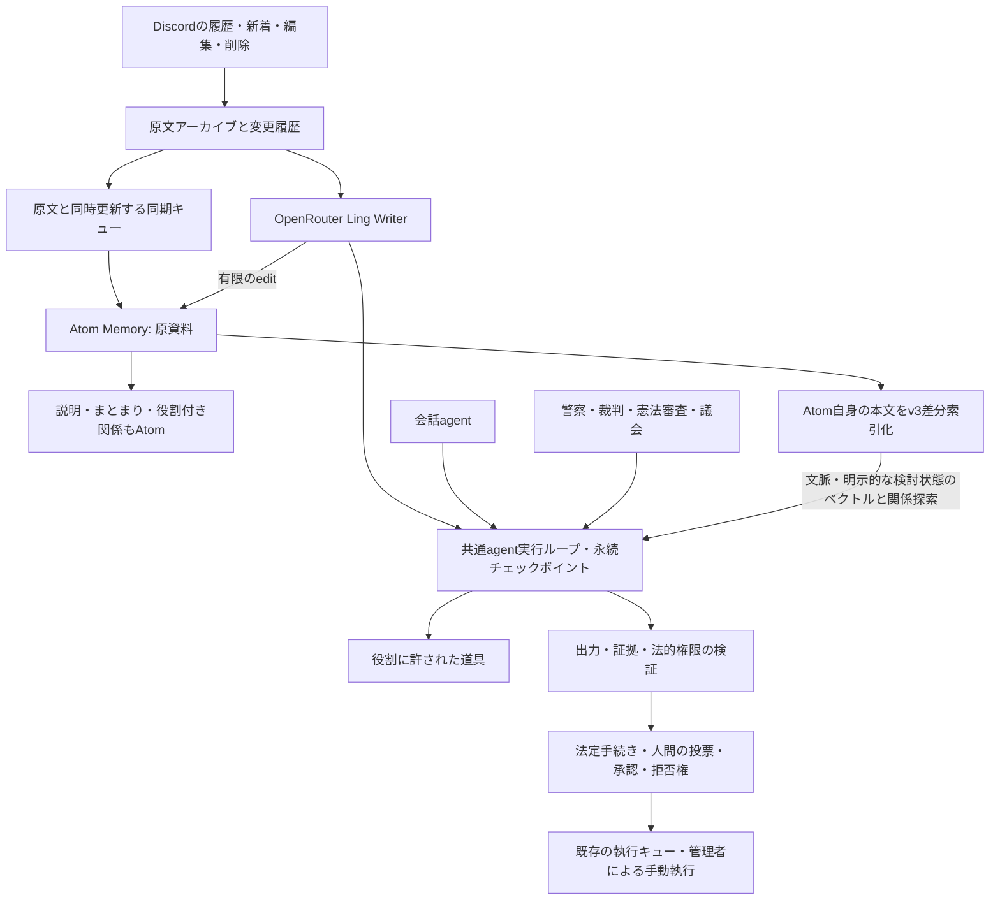

# 会話構造・Atom Memory・agent実行基盤

Sakanaの会話agent、Memory Writer、警察、裁判所、憲法審査院、議会は `src/ai/runtime.js` の同じ実行ループを使う。役割ごとに変えるのは、モデル接続、入力、許可された道具、予算、結果の検証である。統治の機関・手続き・調査権限は、引き続き適用される憲法と成立した組織法が定義する。



## ライブラリとAgentの責務（Atom 0.9）

| ライブラリ: Atom                                                  | Agent / ホスト: Sakana                                 |
| ----------------------------------------------------------------- | ------------------------------------------------------ |
| 本文・関係・不変版の保存と原子的な一括write                            | 履歴の入力範囲、意味分解、関係の作成、モデルの出力検証 |
| スコープ認可、出典、入力依存の鮮度検証                            | Discordの閲覧条件、生成物の採用、制度ごとの証拠条件    |
| Atom自身の本文による候補取得、構造による順位、本文のパッキング    | モデル選択、context/thoughtの供給、ステップごとのread  |
| `AvailabilityModel` の状態検証、model ID、dedup、atomicity、purge | 何をモデルへ届けたか、成功応答後の `recordUse` 通知    |
| `stale` の参照を返す                                              | 既存Writerキューへの再処理要求、重複防止、費用、再試行 |
| 改訂と索引更新の操作                                              | 呼出し時期、永続化バリア、処理済み位置、履歴の保持方針 |

Atom内のMemoryHarness、read時Generator、後継採用と保持履歴の高水準APIは削除した。独自のAgentループをSakanaへコピーせず、既存のrunAgentとWriterを利用する。通常の観測版・logicalリンク・CAS・削除依存は維持する。

Atom 0.7の利用可能性は、`AvailabilityModel<S extends Json>` の `id`、同期的な `update(previous, acceptedAt)`、同期的な `value(state, now)` で表す。既定の `adaptiveUse()` は `{ mass, updatedAt, halfLifeMs }` を1KiB以下で保存し、初期7日・最大365日を基準に間隔のある利用を反映する。Atomはcallbackへquery、context、最終score、候補graph、全履歴を渡さず、非有限値・Promise・例外を0へ丸めない。model IDやパラメータが変わった保存状態は `STATE_INVALIDATED` として、Sakanaがscopeを明示resetする。これは利用可能性を調整する bounded engineering approximation であり、脳の再現や経験的最適値ではない。

`conversation/memory.js` は原資料投影と認可、実際のモデル入力に対するInputToken、commitの再送と索引確認を接続する。Writerは既存Atomを一段ずつinspectし、新しく発見した参照や原資料を続けて調べる。変更は一括writeのcreate・revise・retireで保存する。reviseは観測版へCASを行う。計画、InputToken、原資料hash、参照、cursorをcheckpointへ保存し、commit後に応答を失っても同じidempotencyKeyで回復する。

同じモデル呼び出しが生成した変更は同じ入力依存を共有する。同じcommitに入っただけの独立した生成へ、依存を追加しない。本文・意味的な役割・利用時の活性度も区別する。Agentの判断とライブラリの検証の境界、原文ごとの処理結果、公開チャンネル間の共有は[Writer設計](writer-design.md)に定める。

検証は `scripts/check-memory-refresh.mjs`、`scripts/check-memory-writer.mjs`、`scripts/check-agent-runtime.mjs`。実モデル評価は従来の `check-memory-writer-live.mjs` と `check-memory-embedding-live.mjs` に置く。

## 会話を文字列の列として扱わない

`src/conversation/message.js` が `discord.message.v1` を定義する。新着、検索結果、アーカイブ、統治の調査、Atomへの保存に共通の構造を使う。

| 項目                                  | 意味                                                                           |
| ------------------------------------- | ------------------------------------------------------------------------------ |
| `id` / `location`                     | 発言ID、サーバー、チャンネル、スレッドと親チャンネル                           |
| `author`                              | 発言者ID・表示名・botか・応答中のbot自身か                                     |
| `body`                                | 投稿者が書いた本文。抜粋なら `complete=false` と元の長さを明示                 |
| `reference`                           | 返信、転送、スレッド起点、旧記録で種類不明の参照を区別。宛先IDと取得状態を保持 |
| `forwarded`                           | 転送スナップショット。Discordが原著者を返さなければ `authorId=null`            |
| `attachments` / `embeds` / `stickers` | 本文と分離した添付。埋め込みの説明を送信者の主張にしない                       |
| `mentions` / `reactions`              | 言及・リアクション。返信や賛否の確定とは扱わない                               |
| `state`                               | 作成時刻・編集時刻・削除・ピン・メッセージ種別・観測したメタデータ             |

返信先の参照番号は結果の表示順に左右されない。参照先を取得できなければIDを残し、未取得・取得不能・確認された削除を区別する。転送は返信連鎖に含めない。会話の先読みでは別チャンネルへ参照をたどらず、閲覧権限を持つ読み取り手段に任せる。返信連鎖の深さ上限も明示する。

既存DBの本文から「これは返信だった」「原著者はこの人」と推定しない。古い行は `legacy_incomplete` とし、Discordから再取得できた時点で埋める。引用文や二人称の意味までは機械的に確定できないため、agentは明示された関係と文脈を見て判断する。

## 記憶の所有者と出典

情報の分離単位はDiscordのサーバーIDにする。同じbotとSQLiteを共有しても、履歴のID指定・返信の辿り直し・リアクション・模倣用の実発言・Atomの記憶と集計値・agentの途中記録は、呼び出し元サーバーの範囲で扱う。非公開チャンネルの閲覧条件も維持する。同じrun IDでも別サーバーの実行は再開しない。モデル自体の利用先にはサーバー制約を設けない。

モデル選択と話者設定は `(guild_id, user_id)` ごとに保存する。旧来のユーザー単位の設定は所属先を断定できないため、`agent_engine_legacy_unscoped` / `agent_persona_legacy_unscoped` に保持し、各サーバーへ自動配布しない。新しいサーバー別設定の既定は通常のagentとbot自身の話者である。

- ライブラリは独立した `subprojects/atom-memory` の公開エントリーポイントを使う。独自のAtom実装やライブラリ内へのSakana固有処理は追加しない。
- 原文の正本はアーカイブ。意味情報の正本はAtomの受理済みの版で、説明・まとまり・関係も同じAtom形式にする。バッチやキューは輸送・再開の管理であり、別の意味モデルや話題の所属ではない。
- 権限はサーバー・チャンネルごとのpolicyにする。entityも同じ範囲に置き、関係をたどることで別の非公開チャンネルへ越境させない。
- 会話の自動想起は応答するチャンネルに限定する。現在見えているユーザー・assistant・toolの文脈と直近のtool観測を使い、固定した元の質問を毎回の自動readへ持ち越さない。統治の自動想起は現在公開されているチャンネルに限定し、機関に `search_messages` が許可されている場合だけ使う。取得した新しい原文は法定の調査手数・出力量へ計上する。
- 原文の取り込み権限はhostだけが持つ。AIの生成物を原文・証拠・法律へ昇格させない。LingのWriterが会話から主張・条件・反論・決定事項・未解決点などを抽出する。出自はorganizationとしてhostが設定し、実際に読んだ原文版をsourcesで指定する。
- 編集・削除は永続キューで追随する。旧Atomをpurgeし、それに依存する観測を無効にする。原文を読んでから回答するまでに変更や権限失効があれば、その実行を失効させる。統治の再試行では新しい記録から調査し直す。
- アーカイブの `message_versions` は導入後に観測した本文の編集・削除前の状態を保存する。導入前の編集履歴や、既に消えて取得できない発言を復元したことにはしない。

Atomの自動想起は予算内の候補検索で、全履歴の完全走査ではない。診断と同期残数を入力へ添える。候補に出なかったことを「発言が存在しない」と解釈せず、必要なら既存のアーカイブ検索で全期間を調べる。

大量取り込みではAtomのSQLiteを `synchronous: 'NORMAL'` で使い、バッチの `flush()` が成功してから原文側のキューを確認・削除する。保存途中の停止やflush失敗では処理済みにしない。Atomの通常利用は従来どおり `FULL` が既定である。Bot稼働中にDiscordを再取得するCLIは `--index-only` を付け、Atomへの書き込みをBotのworkerに任せる。

## Atomの設計に沿ったWriter

[Atomの設計](../subprojects/atom-memory/docs/specification.md)と[出典・関係のAPI](../subprojects/atom-memory/docs/concepts.md)に従う。AIが本文・役割・意味上のまとまりを提案し、hostが参照・出典・版を検証する。Sakanaの共通runAgentをハーネスとして使い、第二のエージェント実行ループは追加しない。

- 毎回のモデル呼び出し前に関連する記憶を読み直す。必要ならWriter自身がmemory_searchを呼び、同じ内容のまとまりを再利用する。
- Writerは有限のAtom編集案を出す。通常の二項関係は役割付きリンクで保存し、関係自身に本文・出典・改訂・認可・n項参加者・さらにリンクが必要な場合だけ関係Atomにする。全件ルートや親の巨大メンバー配列を要求しない。
- 条件のrequiredリンク、根拠の観測版参照、sourcesを残し、全変更を公開APIのeditで一括確定する。モデルがsource区分、policy、任意IDを割り当てる経路はない。
- モデルへ渡した文脈全体の入力依存を記録する。編集・削除が入れば旧解釈を想起から外し、関連バッチを再処理する。資料の訂正と別人による反論を同じ操作にはしない。
- 想起にはAtomのread.textを使い、役割付きリンク・出自・共有引用の対応を保つ。警察・裁判へは原文の必須同梱と既存の証拠採用検査を通して渡す。生成要約を正式な投票や成立済みの法律として扱わない。
- Writerは既存の発行済み整理を `revise` で改訂できる。別人の異なる主張を一つの事実へ上書きせず、条件・根拠・必要な関係を新しい版へ残す。
- 失敗は未処理として再試行する。モデル出力、Atom確定、flush、キュー確認を区別し、確定後の再起動では同じAI呼び出しを繰り返さない。

会話・Writer・警察・裁判・議会の有料リクエストは `src/ai/provider.js` に集約する。OpenRouterのChat Completionsと標準のreasoning形式を使い、ツール継続に必要なreasoning_detailsを保持する。Writerの状態と累積バッチ数を確認する:

```sh
npm run memory:organize -- --status --guild SERVER_ID
```

Botを止めた検証環境で一バッチだけ整理する:

```sh
npm run memory:organize -- --guild SERVER_ID --batches 1
```

通常はBotのworkerへ任せる。CLIのWriterにも共有の実行leaseがあるが、原文同期だけの旧CLIと同時にAtomへ書き込まない。

## 共通実行ループ

モデルが道具を選び、hostが許可と予算を検査して実行し、観測を保存して次の推論へ進む。最終結果は従来のスキーマ・引用・法的条件の検証を通す。

- それぞれの道具の結果とカーソルを、次のAPI呼び出しより前にSQLiteへ保存する。調査の通信失敗は実行失敗として再試行し、有罪・無罪・不受理には変換しない。
- 同じ入力の未完了runは再開する。完了したrunと独立の再審議は別runにし、過去の判決を単なる入力一致で再利用しない。
- 再開時に参照先や権限が失効していれば、古い観測を使うrunを破棄して次回は新規調査にする。
- 法律・憲法・会話の長いツール結果は、JSONを壊さず `documentHash` / `offset` / `nextOffset` 付きでページ化する。未読部分を証拠台帳へ登録しない。同じ結果を読み直した場合は、入力内に残した最初の全文を参照する。
- 憲法の調査ツールには当該事件・手続きに固定された憲法を渡す。調査中に改憲されても、その事件の準拠版が勝手に変わらない。
- 証拠採用時にはDiscordの原文・発言者・ハッシュ・閲覧権限を再確認し、返信・転送等の会話構造も事件記録へ固定する。追加調査で見つけた資料にも同じ確認を適用し、再取得の通信障害を「資料なし」として判決へ進めない。
- 警察・裁判・憲法審査のagentは調査と構造化判断を担当する。投票、承認、拒否権、判決の執行は既存の法定手続きと権限検査を通る。ban/kick等の管理者による手動執行はそのまま維持する。
- ブラウザなど外部状態を変え得る道具が実行中に途切れた場合、結果が不明な操作を自動で再送しない。読み取り専用の調査とは再開条件が異なる。

`memory_focus` は共通runtimeの道具で、モデルが一要求で次に調べたい焦点と短い明示的な検討状態を指定する。focusは現在の可視文脈へ追加され、置き換えない。次のモデル呼び出し前に、それらと直近の観測をベクトル化し、記憶と関係を選び直す。provider応答が成功してcheckpointへ保存された時点でfocusを消し、readまたはtransportが失敗した要求では保持して再試行する。前回自動挿入した記憶を検索入力へ再帰的に混ぜず、自動memory self-feedも行わない。明示的な `search(query)` とWriterの `memory_search` は一回の要求として別に扱う。

providerが返す人間非公開の `reasoning_content` / `reasoning_details` は、ツール継続に必要なプロトコル情報としてcheckpointへ保持することがある。ただしそれをAtomの本文・利用可能性signalへ渡さない。保存するのは入力、通常のモデル応答、実行した道具、観測、予算、検証済みの結果である。実行DBはhost側の監査データであり、一般会話への無条件の記憶入力にはしない。

## セットアップと既存履歴の移行

### 既存設備で動かす構成

常駐するNode botと同じホストにアーカイブ、Atom DB、実行DBを置く。構造化のために別サーバー、外部ベクトルDB、GPUを追加する必要はない。返信・転送・編集等のメタデータはDiscordから正確に保持し、その意味をLing Writerが整理する。既定は `inclusionai/ling-3.0-flash` の非思考モード。最大60発言・60KBを一つの輸送単位にし、前後の文脈と同じチャンネルの返信先を含める。古い未処理履歴と新着を永続キューで処理し、静かな状態を60秒待って細切れの再推論を減らす。

既存アーカイブを移行元にし、メタデータが不足する記録だけを取得可能な範囲で補う。Atomへの同期は専用worker threadで少量ずつチェックポイントを残し、Discordの応答処理を止めない。検索時に全件同期を待たず、同期待ちの原文を候補から除外する。保存先は派生データと変更履歴の分だけ増えるため、本番の全件移行前に小規模なコピーで追加容量と処理速度を測定する。常駐中の別モデルの整理は、この移行とは別の運用判断にする。

Node.js 22.13以上が必要。

```sh
git submodule update --init subprojects/atom-memory
npm ci
npm run check
```

`npm ci` のprepareで固定したAtomソースをビルドする。コンパイラは `atom-memory-typescript` というnpm aliasに固定し、既存UI依存のTypeScript peerと混在させない。production用にdevDependenciesを取り除く場合はビルド後に行い、Atomのdistを実行環境に含める。

既にアーカイブにある履歴の原文とDiscordメタデータを同期する（これだけではAIによる意味の整理は完了しない）:

```sh
npm run memory:structure
```

対象サーバーを明示してDiscordから取得できる最古まで取り込み、Atomへ同期する:

```sh
npm run memory:structure -- --discord --guild SERVER_ID
```

従来の取り込みで返信・転送等のメタデータが不足している場合は、原文を保持したままDiscordの取得位置をリセットして再取得する:

```sh
npm run memory:structure -- --discord --guild SERVER_ID --refresh-structure
```

このCLIはbotの応答・メッセージ送信・退出・統治スケジューラを開始しない。取り込みは既存indexerのチェックポイントで再開する。`--refresh-structure` を再度指定すると先頭から再取得するので、中断からの再開時は外す。

Dream有効時は原文・索引workerとAI workerを既存Bot内で分ける。原文同期残数とAI未処理数は別に表示する。初回開始にはindexerの全列挙・取得完了の証明が必要。権限不足、既に削除された発言、列挙上限に達したスレッドなどを隠さず、キューが空になっただけで「Discordの全履歴を保有した」とは判定しない。Writerの原文処理、定期見直し、Qwen埋め込み、永続予算は[Dream運用](dreaming.md)を参照。Dream無効時は既存workerを維持する。

| 設定                 | 既定値                              |
| -------------------- | ----------------------------------- |
| `ARCHIVE_DB_PATH`    | `archive.sqlite`                    |
| `ATOM_MEMORY_PATH`   | `ARCHIVE_DB_PATH` + `.atoms.sqlite` |
| `AGENT_RUNTIME_PATH` | `DATABASE_PATH` + `.agents.sqlite`  |

アーカイブ、Atom DB、実行DBはそれぞれWALを含めてバックアップ対象とする。Atom DBを新規作成した場合はアーカイブ全件を再同期する。

## 検証

`check-memory-writer.mjs` はAI生成関係の想起、出典の検証、別サーバーの分離、API障害、確定後の停止からの再開、削除後の無効化を検査する。`check-memory-writer-live.mjs` は隔離した合成会話を実Lingで整理し、生成されたAtomがBotの想起経路へ戻ることを検査する。`check-agent-runtime.mjs` は会話の関係・出典・非公開情報の分離・編集・削除・再起動・途中再開を検査する。`check-agentic-governance.mjs` は調査失敗、長文のページング、即時保存、agenticな憲法審査、証拠台帳との一致、憲法の版固定を検査する。`check-guild-isolation.mjs` は別サーバーのID・同じユーザー・同じrun ID・非公開チャンネルを組み合わせて情報が混ざらないことを検査する。これらは `npm run check` に含まれる。外部モデルを使う品質評価と本番への反映は、これらのローカル検査とは別である。

## 索引更新と費用の所有者

Atomは有限の `write` / `inspect` / `indexAtoms` / `updateIndex` / `read` を提供するJSライブラリ。ジョブの起動・頻度・OpenRouter・埋め込みworker・API費用はSakana側に置く。新規のWriter出力はAtomへ確定した後に優先してベクトル化し、索引失敗時は保存済みAI結果から再開する。v3索引は変更されたAtomのown bodyだけを処理し、targetの改訂や所属の追加だけで本文が同じ親を再エンコードしない。全policy scopeをそれぞれのcurrent-head走査または変更フィードの終端までdrainするまで、意味検索の準備完了を宣言しない。

検索はSQLiteのベクトル近似候補と語句候補を合わせ、実ベクトルで採点して深さ2まで関係を展開する。権限・証拠・出力量の検査は共通のまま。全履歴の取り込み完了や完全な上位検索を近似探索の終了から判定しない。[費用・見積もり・日額上限](memory-cost.md)を参照。

## Atom 0.7 の利用可能性と継続するまとまり

`search`・`read`・自動想起はAtom自身の本文と、役割・方向の重み付き伝播で順位を決める。リンク先本文は親の検索表現へ暗黙に連結しない。`score` はqueryへの相対関連度で、真偽や絶対的重要度ではない。LLMの重要度採点や全履歴の重要度更新ジョブは持たない。最大64 seed・512ノード・4096リンク・深さ2が既定で、`maxNodes` は新規ノードを制限し、既存ノード間の辺は別に収集する。近似診断は全履歴の網羅性を証明しない。詳細は[ライブラリのランキング](https://atom-memory.takos.jp/ranking)。

Writerが既存のcollectionへ接続するリンクはlogicalにし、継続的な改訂へ追随する。根拠や主張はobservedで特定版を固定する。原資料の訂正・削除、サーバーとチャンネルの読取権限は順位とは別に検証する。エンコーダーの識別子と表現が同じなら、ランキングを変えてもベクトルを再計算しない。EvexのE5からQwenへの変更では識別子も変え、Qwen用に再索引する。

モデル変更後に旧モデルの途中のツール会話を再開しないよう、共有ランタイムのチェックポイント照合にproviderとmodelを含める。投票・承認・拒否権・手動ban/kickの執行条件は各機能の既存のホスト検証を使う。

## モデルへ渡した記憶の利用を自動記録する

Atom 0.7は `b = m(1 + βu/(1+u))`、`a = b + Tᵀa` の一つの評価規則で読む。`m` は本文と現在入力の一致、`u` は主体・policy・観測版ごとに選んだ `AvailabilityModel` の値で、β=0.3と伝播α=0.5は従来の80/20本文入力とともに既定を維持する。関係・認可・鮮度検証済みの有限グラフを固定してから利用可能性を反映する。利用回数で本文・所属・権限は変えない。数値予算と誤差はAtomの診断で返す。

Sakanaは最終フィルタ後の `packed.memory` と実際の引用本文 `packed.evidence` の参照を、ホスト専用の付帯データに保持する。Writerの `memory_search` も同じ仕組みを使い、モデル要求に残っている過去のtool本文も対象にする。内部候補・伝播だけで触れた参照は含めない。参照一覧や利用の操作をモデルの自己申告にしない。

成功したprovider応答と現在性を確認したら、応答・対象参照・未通知状態を既存 `agent_runs` へ保存し、`host.recordUse` を自動実行する。event IDは永続run IDとmodel roundで固定し、同じ観測版は一要求につき一度だけ数える。JSON検証や外部操作の承認・Discord送信を待たずに記録し、次の検索から効く。記録後の障害は同じeventを再送しても増えず、未通知の保存済み応答はモデルを呼び直さずに処理する。

参照が256件を超える場合も同じevent IDのまま分割して通知する。途中まで記録した後の再開では、済んだ分を重複として扱い、残りだけを加算する。実行全体の累積usageと今回の呼出しのusageを分け、チャットの費用台帳には今回分だけを反映する。利用通知だけを再開した場合、モデル費用を再計上しない。

通常チャットのrun IDはguild・channel・member・Discord入力message IDから作る。新しい発言は別の実行になる。再開時には現在のscope・原資料hash・Writer batchを確認し、削除・変更・権限撤回後の古い入力には利用を加算しない。subjectは従来のchat利用者・institution・Writer単位、policyはguild/channel単位を維持する。稼働Botへの反映は別のデプロイ工程である。
