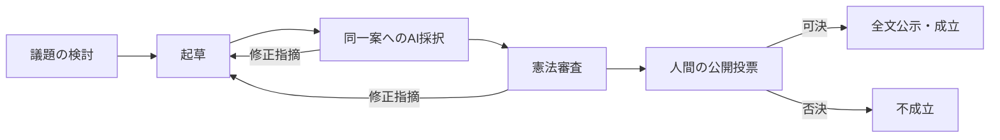

# 法令に基づく自律統治

AIは調査、制度設計、起草、審査、指摘への修正、期限の管理と執行を担当する。
人間は提案、意見、証拠、異議を提出し、法令で定める段階で投票・承認する。
自律性は人間の意思決定を排除することではなく、AIが自分の職務を遂行することを意味する。

## 正本と権限

| 定義 | 正本 | 変更の手続 |
| --- | --- | --- |
| 基本権、法律への権限委任、改憲の最低条件 | 憲法の本文と `sakana.constitution/v2` | 現行の改憲手続 |
| 機関名、職務、AI席数、判断の必要票、調査手段 | 成立法の `provisions.governance` の `institution` | 通常の立法手続 |
| 段階、遷移、期限、改稿上限、開始イベント | 同 `procedure` | 通常の立法手続 |
| 投票条件、処分上限、承認人数、調査・記録規則 | 同 `regulation` | 通常の立法手続 |
| 機関・手続と実装済み職務の対応 | 同 `binding` | 通常の立法手続 |
| DB整合性、未知の操作の拒否、外部API上限、通信再試行 | 実行基盤 | コードの変更 |

各定義は同じ法律の条項を根拠として持つ。別の法律が同じ定義を競合して設置することはできず、
その定義を持つ法律を改正する。根拠の法律ID、条項、版とハッシュを案件ごとに保存する。
制度を変更する案は、成立前の制度に従って採択・審査・投票される。

進行中の事件では、行為時に有効だった法律の版を適用する。通常の改正で旧版が
`superseded`になっても審理を継続できる。行為が旧版の施行期間外だった場合や、
その法律が停止・廃止・違憲となった場合には処分を進めず、取消・救済の対象として扱う。

## 制度が成立しなくなった場合の修復

憲法第十五条と実行定義の`recovery`が、制度修復の暫定権限を定める。
有効な法令一式を構成できなくなった場合、同じ憲法の下で最後に有効だった手続を保存記録から解決する。
使える権限は、代替組織法の成立と権利救済に限る。新しい処罰手続と処分の執行は止める。
停止・失効・違憲となった法律の状態は変更しない。

AIは欠落した制度と以前の定義を調べて修復法を起草し、従前の憲法改正手続による
独立した採択・憲法審査を受ける。全体選挙人の公開投票を必要とし、改憲の賛成割合・
定足数と拒否条件を維持する。投票期間は従前の改憲期間と憲法の最低期間の長い方で、
全員が投票しても早期成立させない。有効な制度を構成できる代替法の成立で通常運転へ戻る。

この暫定権限のない既存憲法へ、コード更新だけで権限を追加することはない。
憲法の変更は、移行または現行の改憲手続を経て初めて効力を持つ。

## 初期制度

[統治組織手続法](founding-laws/organization.json)を憲法とともに導入する。
通常法の標準手続は以下の通り。



初期法では、通常法・改憲とも12時間の記名投票、全員投票時の早期開票、定足数、
特別有権者の拒否条件を定める。通常法の投票を省略する場合は、通常法の手続から
`public_vote`段階を除く法律改正を、変更前の投票ありの手続で成立させる。
改憲の人間投票は憲法の最低条件であり、通常法だけでは除けない。

重大処分は独立した裁判所の判決に加え、法律で必要とされる人間の承認を受ける。
初期法では即時上限を超えるタイムアウトに1人、追放・参加禁止に2人の承認を要する。
承認の標準期限は3日、当事者は承認者から除外し、拒否1票または承認不足での期限満了により
執行を取りやめる。法律で承認資格を全員、特別有権者、管理者、統治運営者、指定ユーザー・ロールに定め、必要人数を変更できる。
承認を省略する場合も法律の変更を必要とする。

ban・kickは、必要な承認と上訴期間を経てから管理者の手動執行を待つ。
既存の「手続」の案件カードに「執行完了」を表示し、人間のDiscord管理者またはサーバー所有者が押すと、
報告者・日時・対象処分を記録する。ボタン自体はDiscordのban・kickを実行せず、管理者の完了報告として扱う。
取消時も同じカードでBAN解除、またはkickの取消通知・再参加案内の完了を記録する。
承認者・拒否権者と実際の執行者は別の資格であり、承認資格だけでは完了を記録できない。
Botには `BanMembers`、`KickMembers`、それらを包含する `Administrator` を付与しない。
この執行能力の制限は法律を書き換えても解除されない。タイムアウト等の従来のBot執行は維持する。

投票は対象全文、承認は対象処分に結び付ける。変更後の本文・処分へ判断を流用しない。
開始時の有権者・承認資格を保存するため、後からロールの設定を変えても進行中の条件は変わらない。

## 人間の承認権と拒否権

承認者と拒否権者は別々に指定できる。管理者であっても、法律が拒否権を与えていなければ行使できない。
拒否権は記名の「拒否権を行使」ボタンで行使し、通常の反対票・承認しない判断とは別に記録する。

| `scope` | 対象 |
| --- | --- |
| `trusted` | ownerが統治画面で指定・登録した特別有権者ロールの人間 |
| `administrators` | DiscordのAdministrator権限を持つ人間とサーバー所有者 |
| `operators` | サーバー所有者と`GOVERNANCE_OPERATOR_USERS`の人間 |
| `designated` | 同じ定義の`users`のユーザーID、または`roles`のロールIDに該当する人間 |
| `all` | サーバー内の人間全員 |

Botは含まない。処分の承認・拒否権では申立人と被申立人も除く。指定IDは17〜20桁のDiscord ID。
`designated`はユーザー指定とロール指定のいずれか、または両方を使える。

たとえば、処分の`human_approval`段階の`config`を次のように法律で定めると、管理者が承認し、
登録済みの特別有権者は1人で拒否権を行使できる。承認の必要人数は処分規則の`sanctions.approvals`で定める。

```json
{
  "phase": "approval",
  "scope": "administrators",
  "excludeParties": true,
  "rejectVotes": 0,
  "veto": { "scope": "trusted", "required": 1 }
}
```

`rejectVotes: 0`では、承認者が「承認しない」と判断しても即時中止にはせず、期限満了時に承認数で決める。
正の値なら、その人数の承認者による拒否でも中止する。独立した`veto`の必要人数に達した場合は即時に中止する。
処分手続に`veto`がある場合、承認人数を0にしても拒否期間は省略できない。

法案では投票規則の`votes.law.humanVeto`、改憲では`votes.constitutionalAmendment.humanVeto`に、
同じ`scope`・`users`・`roles`・`required`を指定する。たとえば`{"scope":"administrators","required":1}`で
管理者1人の拒否により成立を止められる。通常の特別有権者の反対票による拒否条件とも独立して評価する。
`humanVeto`を設けた案には`public_vote`段階が必要で、その期間が拒否権の行使期間になる。

拒否権がある案件は、賛成・承認が早く集まっても拒否期間の満了まで成立・執行しない。
法律に`humanVeto`・`veto`を書かなければ独立した拒否権は追加しない。人間の権限を管理画面から黙って増やすことはできず、
現在の法令が定める立法・改憲手続で権限と対象を公開して決める。
指定管理者・指定ユーザー向けの承認カードは公開の「手続」に表示し、無関係な特別有権者ロールへの一括通知は行わない。

## AIの職務と失敗

AIへの審査指摘は、前の案とともに次の起草入力へ渡す。変更のない案を何度も採決して
都合のよい判断が出るまで繰り返すことはしない。改稿回数は法律が定める。
採択または合憲判断に必要な席が通信・出力検証の問題で欠けた場合、政治的な否決や有罪にせず
保存済みの段階から再試行する。根拠法令が変わった立法案件は、以前の本文・判断・票を履歴へ
保存し、最新法令で再検討する。

追加機関は名前と職務を法律に記し、既存の読取り専用調査手段を使わせられる。
追加手続の開始イベントは定期実行、提案受理、法令成立から選ぶ。
`agent_task`は調査結果の記録または立法議題の提案を行う。新しい外部操作や処罰権限を
任意の文章で増やすことはできず、新たな操作には実行基盤側の実装が必要。
機関が作る提案にも、開始時の法律が定める標準の投票範囲を使う。
以前の不具合で`none`となった機関提案は、投票資格や票をまだ保存していない場合に限り、
同じ適用法令の標準範囲へ修復し、変更を監査記録に残す。

待機は`wait`など期限を実行する段階に定義し、`agent_task`や通知に期間を書いても受理しない。
`maximumVisits`は完了した操作の回数を制限し、上限時には法律が指定する終端へ移す。
通信失敗は回数を消費せず、同じ職務を再試行する。待機段階や外部執行待ちには
この回数制限を指定できない。裁判と定期機関・立法は同じ訪問回数の判定を使う。

成立通知、法令サイトへの公開、処分・取消は再試行可能な実行記録に残す。
外部サービスへの送信後に接続が切れた場合には通知が重複する可能性があるが、
同じ立法案件の法律や、同じ機関の提案・記録は重複して作らない。

Botの執行と管理者の完了報告は、最新の裁定・処分の版・承認・拒否期間・制度の有効性を
共通の処理で検算する。Discordのメンバー取得などを待った後にも執行直前に検算する。
Botの外部処分は送信前の実行予定と送信後の結果を保存し、送信中に取消が起きた場合は
取消を上書きせず解除を予約する。外部処理と解除は一つのBotプロセス内で順番に実行する。

制限ロール・権限上書きの削除に失敗した場合は解除済みにせず、失敗の内容を保存する。
既に存在しないメンバー・ロール・チャンネル・権限上書きは解除済みとして扱うが、
権限不足や通信障害は握り潰さない。解除は五回で打ち切らず、間隔を延ばして再試行する。

## 既存制度からの移行

DBの白紙化や現行憲法の直接置換は行わない。

```sh
node scripts/propose-governance-migration.mjs --guild GUILD_ID --name SERVER_NAME --actor OPERATOR_ID
node scripts/propose-governance-migration.mjs --guild GUILD_ID --name SERVER_NAME --actor OPERATOR_ID --propose
```

最初のコマンドは移行対象を確認し、`--propose`は改憲の議題を登録する。
いずれも憲法を成立させない。通常の国会でAIが改正案と同時成立させる初期法を検討し、
現行憲法の公開改憲投票にかける。可決した場合だけ、憲法と投票対象の初期法を同じDB取引で
成立させる。以前の事件は受付時の憲法を維持し、未起草の議題は履歴を残して新制度へ移す。
旧制度で始まった投票も開始時の規則を保持する。旧制度を処理するコードはこの経過措置のために残る。

## 検証

`npm run precheck`は通常法の投票あり・なし、AIによる改稿、審査障害と再開、追加機関の実行、
人間の承認・拒否、管理者と指定ユーザー・ロールによる独立した拒否権、資格の保存、拒否期間の保障、違反調査、旧憲法の投票を経る移行、公開・執行の既存検証を実行する。
`scripts/check-governance-recovery.mjs`は、改正後の行為時法、取消と外部執行の競合、解除失敗と再試行、
制度修復のAI審査・公開投票、AI席の障害、機関提案の投票範囲、法定の待機・訪問回数を検証する。
機械的な権限・形式検証とAIの憲法審査は別であり、自然言語の憲法解釈を形式的に証明するものではない。

`GOVERNANCE_GUILD_ID=対象ID node scripts/check-governance-live.mjs`は実Discord・公開法令と実AIの接続・審査を検証する。
DBは一時ディレクトリ内に作り、他人の票・承認を作ったり、本番の法令を成立させたりしない。
`--connections-only`を付けるとDiscordと公開法令の読取りだけを検証する。
